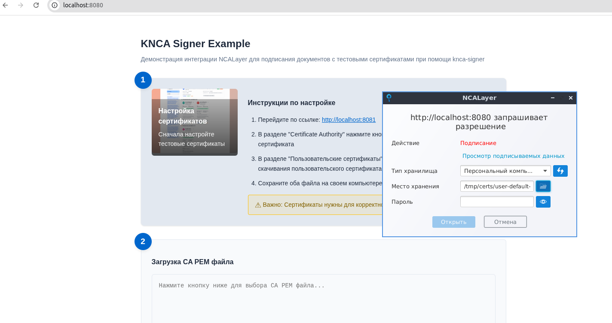
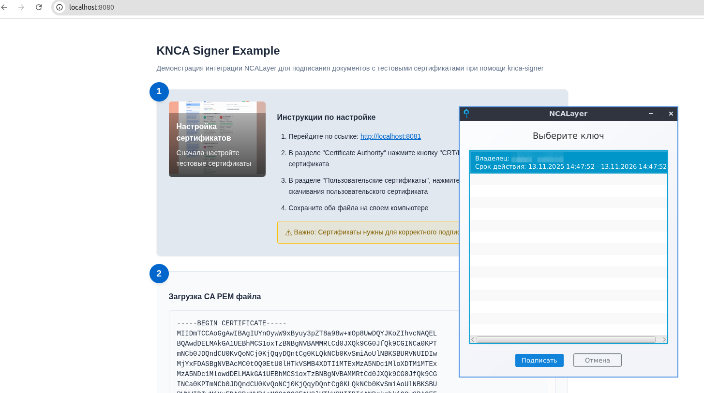

# KNCA-Signer Пример

Простой пример демонстрации интеграции NCALayer для подписания документов с использованием Spring Boot бэкенда и
ванильного JavaScript фронтенда при использовании тестовых сертификатов выпущенных при помощи [knca-signer](https://github.com/gleb619/knca-signer).

## Возможности

- **Управление документами**: Создание и управление XML документами
- **Интеграция с NCALayer**: Подписание документов с использованием казахстанских цифровых сертификатов
- **Web-интерфейс**: Простой пользовательский интерфейс для создания и подписания документов
- **REST API**: Полноценное API для программного взаимодействия

## Предварительные требования

- **Java 17+**: Для запуска Spring Boot приложения
- **NCALayer**: Казахстанское приложение для цифровой подписи
- **Docker**: Для запуска knca-signer и генерации тестовых сертификатов
- **Maven**: Для сборки проекта




## Быстрый старт

### 1. Подготовьте окружение

Установите права доступа для директорий certs и lib (необходимо для корректной работы Docker-контейнера):

```bash
sudo chown -R 100:1000 ./certs ./lib
```

### 2. Запустите KNCA Signer

Запустите knca-signer через Docker Compose:

```bash
docker-compose up -d
```

Сервис будет доступен на порту 8081.

### 3. Сгенерируйте тестовые сертификаты

1. Откройте браузер и перейдите на `http://localhost:8081`
2. В интерфейсе knca-signer автоматически сгенерируются тестовые сертификаты
3. Скачайте файл CA (PEM) и пользовательский сертификат (P12) на ваш компьютер
4. Эти сертификаты будут использоваться в тестовом сценарии подписания

### 4. Запустите демо-приложение

```bash
# Соберите и запустите
mvn spring-boot:run
```

Приложение запустится на `http://localhost:8080`

### 5. Установите и настройте NCALayer

1. Скачайте NCALayer с официального сайта
2. Установите и запустите приложение
3. Убедитесь, что оно работает на `wss://127.0.0.1:13579/`
4. Импортируйте скачанный ранее сертификат P12 (при необходимости)

### 6. Используйте приложение

Откройте `http://localhost:8080` в браузере.

- Создавайте новые документы
- Подписывайте их с использованием NCALayer

## API эндпоинты

- `GET /api/documents` - Получить список всех документов
- `POST /api/documents` - Создать новый документ
- `PUT /api/documents/{id}/sign` - Сохранить подпись документа на сервере

## Как это работает

1. **Создание документа**: Пользователи могут создавать XML документы через веб-интерфейс
2. **Подключение к NCALayer**: Фронтенд подключается к NCALayer через WebSocket
3. **Процесс подписания**:
    - Содержимое документа конвертируется в base64
    - NCALayer открывает диалог выбора сертификата
    - Пользователь выбирает сертификат и вводит пароль (по умолчанию `123456`)
    - Документ подписывается с использованием алгоритмов GOST 34.10-2015

## Разработка

### Структура проекта

```
src/
├── main/
│   ├── java/knca/signer/example/
│   │   ├── Document.java              # Модель документа
│   │   ├── DocumentService.java       # Бизнес-логика управления документами
│   │   ├── DocumentController.java    # REST контроллер
│   │   └── KncaSignerExampleApplication.java # Основной класс приложения
│   └── resources/static/
│       ├── index.html                 # Главная страница
│       └── app.js                     # Логика фронтенда
```

### Сборка проекта

```bash
mvn clean package
java -jar target/knca-signer-example-1.0.0.jar
```

## Устранение неполадок

### Проблемы с подключением к NCALayer

- Проверьте, что NCALayer запущен и доступен на порту 13579
- Проверьте консоль браузера на ошибки WebSocket подключения
- Убедитесь в отсутствии блокировки firewall для локальных подключений

### Проблемы с сертификатами

- Подтвердите действительность и сроки действия сертификата
- Проверьте правильность ввода пароля (для тестового сертификата: `123456`)
- Убедитесь, что сертификат корректно импортирован в NCALayer

### Проблемы с Docker и правами доступа

- Выполните команду `sudo chown -R 100:1000 ./certs ./lib` перед запуском
- Проверьте доступность портов 8080 и 8081
- Убедитесь, что Docker установлен и запущен

### Приложение не запускается

- Проверьте установку Java 17+: `java -version`
- Убедитесь, что порт 8080 свободен
- Проверьте логи приложения на наличие ошибок

## Лицензия

Этот пример предоставляется под лицензией MIT. Приложение NCALayer и связанные криптографические библиотеки имеют свои
собственные условия лицензирования.

**Важно:** JAR файлы Kalkan не могут быть добавлены в репозиторий из-за лицензионных ограничений. Пользователь должен
использовать собственные JAR файлы для генерации тестовых сертификатов.
